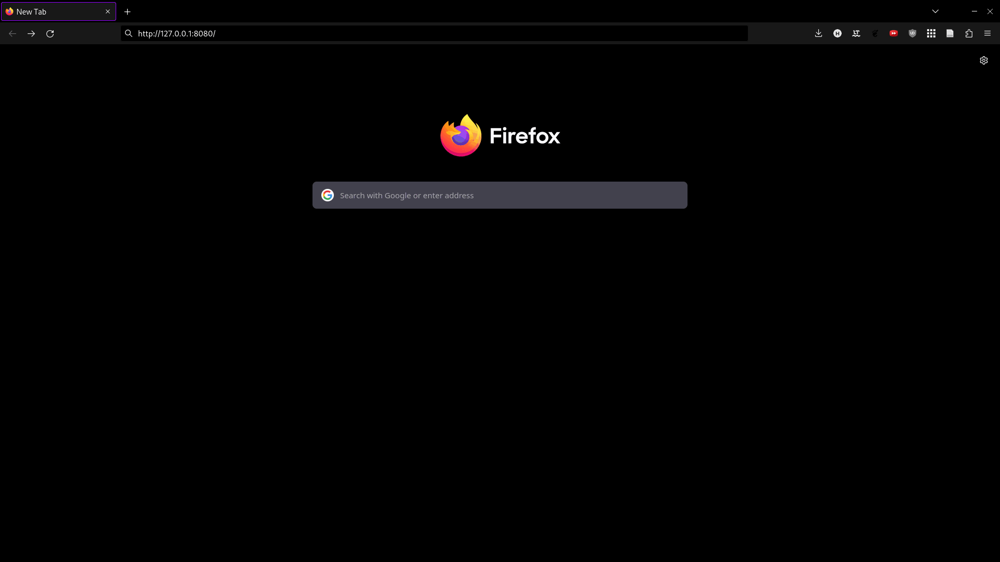

# Golang HTTP Fetch Request
#### Author: Hayden McAlister

---

A very basic example of using Go to serve a webpage, and allowing that page to dynamically update based on fetching to the same Go server.

---

## Running the project

- `go run .`
- Connect to `http://127.0.0.1:8080`
- Click the button to see new content from Go.

## Explanation

The purpose of this proof of concept is to show that a GUI can be developed in HTML/CSS/JS and still get data from a program that is *not* written in Javascript. For a long time I have struggled with the loop of:

- Project idea that would be complemented with a GUI
- Look into GUI libraries for language of choice (not JS)
- Become disgruntled with the mess of native GUI applications
- Realize a web based GUI would be much simpler, but would use JS for the application code
- Avoid project to not write application code in JS

I have nothing against Javascript, in fact TypeScript makes for a relatively nice language! I just don't enjoy creating large projects using it.

After some discussion with a peer I realized that a web GUI is possible with application code in other languages - simply use JS to fetch data from an HTTP server running with the application! In years gone by this may have been a relatively expensive operation to complement a simple application; running an entire HTTP server is not trivial. But with modern computing resources, languages, and simply HTTP server libraries this is much easier.

This project demonstrates a proof of concept - serving a webpage on `127.0.0.1:8080/` that holds a button which, when clicked, makes a fetch API call to `127.0.0.1:8080/content`. The HTTP server (in Go) gets this request, makes some data, marshalls to JSON, and responds to the request. The client side JS can then perform some operation on the JSON, in this example iterating over the contents and adding it to a div to display.

Voilà! Data from Go in a nice webpage GUI! The possibilities are endless.